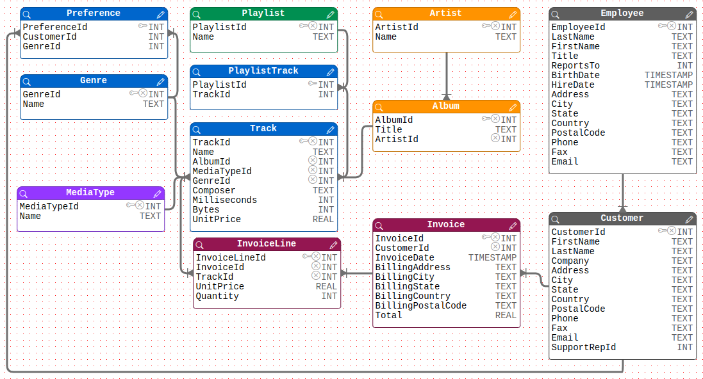

<script setup>
  import RailroadDiagram from '../../../../theme/components/RailroadDiagram.vue'
</script>

# Introduction
## What is MQL ?
MQL is a domain specific language for executing queries on a Relational DataBase Management System (RDBMS) closely to spoken language.  
Initially proposed by gLite, a middleware project for grid computing at LHC experiments, the specification was extended by the AMI team.

## Why using MQL?
Database experts use SQL for querying data, having the knowledge of the database structure that is usually hidden to end-users.  
Dedicated to non-experts, MQL provides a way for querying data with a simplified syntax less prone to error.

### A concrete scenario

You are the boss of the "AMI Music" resellers company.
All the commercial data are store in the following database schema:


<br>
_Fig 1. Database schema_

This schema represents how the various information are structured and linked.
- Your company has employees who take care of your customers.
- Your customers could buy tracks from album of various artists.
- Your customers have some preferences concerning their favorite music genres but of course could buy any track.

As the boss, you would like to answer the following question:

**Who are my employees taking care of 'New-York' city customers?**

The 2 following sections illustrate how the wanted information could be extracted from the database using either:
- SQL query, in other word a database system specific language that have to be written by an expert with the knowledge of the DB structure
- MQL query, a database agnostic language, that could be written by a non-expert user

### SQL query

SQL queries are using catalog / table / field paradigms.

"Customer" and "Employee" are 2 database tables.
"Customer.LastName", "Customer.CustomerId", "Employee.EmployeeId", "Employee"."BirthDate" are some fields of these tables.

An SQL expert knows that the content of "Customer" and "Employee" tables are linked by some special fields:

- The "Employee" key "EmployeeId", a number to identify an employee.
- The "Customer" foreign key "SupportRepId", a number refering to "EmployeeId" number to identify the employee responsible for the sale service.

**Knowing the structure of the database, an expert would write the following SQL query to answer to the boss question:**

```sql
SELECT Employee.LastName, Employee.FirstName
FROM Employee, Customers
WHERE Employee.EmployeeId = Customer.SupportRepId AND Customer.City = 'New-York'
```
### MQL query

MQL queries are using entity paradigms.

- "Employee" represents... the employees.
- "Customer" represents... the customers.
- "LastName", "BirthDate", "City" are respectively 3 information about these human people

The MQL system extract automatically the relations between the employees and their customers, hiding them to the end-user.

**Ignoring how the data are stored, an end-user would just write the following MQL query close to a spoken langage:**

```sql
SELECT Employee.LastName, Employee.FirstName
    WHERE Customer.City = 'New-York' 
```

# The MQL langage
## MQL grammar and concept
The MQL defines grammar and provides concept to interact with any relational data source. It
allows one to perform generic selection, insertion, modification and deletion operations,
keeping benefits of the underlying relational model, but with a syntax less verbose of SQL.
### QIds
MQL introduces the notion of Qualified Identifier (QId) for representing data store in a catalogue.

QIds could be :
- An **entity** representing a category of data in the catalog having some properties.
    - Its syntax is: **[catalog.]entity**.
    - Its SQL equivalent is a table.
- A **field** representing a property of an entity and having a value.
    - Its syntax is: **[[catalog.]entity.]field**
    - Its SQL equivalent is a column of a table

<RailroadDiagram data="
Diagram(
  Optional
  (
    Sequence
    (
      Optional
      (
        Sequence('catalog', '.'),
        'skip'
      ),
    'entity',
    '.'
    ),
  'skip'
  ),
  Terminal('field')
);
"/>

_Fig 2. QId syntax_

### Constraint
QIds syntax is very similar to SQL "table.column" syntax. Nevertheless, as with MQL there is no FROM clause nor JOIN, the same QId could have several meanings depending on the context.

Let's take as an example this MQL query.
```sql
SELECT Genre.Name
WHERE Customer.City = 'New-York'
```

It will return some results... but looking at the "AMI Music" catalog schema they could have several meanings. Results could be:
- The set of music genre the customers from New-York city bought, following the **path** Customer > Invoice > InvoiceLine > Track > Genre
- The set of music genre the customers from New-York city prefer, following the **path** Customer > Preference > Genre

MQL constraints are defined to solve this paradox. They could be added inside brackets to any QId in an MQL query.
- The constraint syntax is: **QId{[!][[catalogue.]entity.]field, ...}**

<RailroadDiagram data="
Diagram
(
  Terminal('QId'),
  Optional
  (
    Sequence
    (
      '{',
      OneOrMore(
        Sequence
        (
          Optional
          (
            '!',
            'skip'
          ),
          'QId'
        ),
        ','),
      '}'
    ),
    'skip'
  ),
);
"/>

_Fig 3. QId constraint syntax_

If the boss wants to know the genre preferences of New-York city customers, one could write

```sql
SELECT Genre.Name
WHERE Customer.City{Preference.CustomerId} = 'New-York'
```
or

```sql
SELECT Genre.Name
WHERE Customer.City{!Invoice.CustomerId} = 'New-York'
```

Basically, a constraint could be seen as an authorized or forbidden path to navigate from an entity to another in a graph representing a relational database.

### Isolation
## Query Syntax
### SELECT
### UPDATE
### DELETE